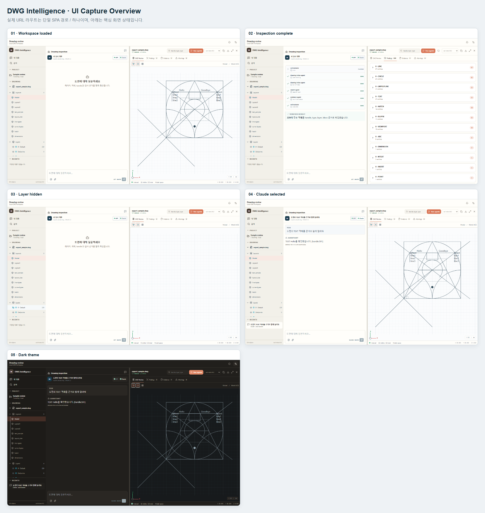

# DWG Intelligence

Local-first DWG/DXF inspection workspace. A deterministic parser produces a
versioned CAD index; agents and OAuth CLI providers may reason over that index,
but never invent or directly decode drawing geometry.



## Start here

Requirements: Node.js 24+, npm, .NET 9 SDK, and Playwright Chromium for browser
tests.

```powershell
npm install
npm --prefix frontend install
npm run verify
npm run test:e2e
```

Run the local application in two terminals:

```powershell
npm run gateway
```

```powershell
npm --prefix frontend run dev
```

Default URLs are `http://127.0.0.1:4317/api/health` and
`http://127.0.0.1:4173/`. Override them with `DWG_GATEWAY_PORT` and
`DWG_FRONTEND_PORT`.

## Repository map

| Path | Owner | Cross-repository access |
|---|---|---|
| `packages/contracts` | Runtime-neutral DTOs and validators | Public: `@dwg/contracts` |
| `backend` | ACadSharp DWG parsing and normalized geometry extraction | Internal parser implementation |
| `agent/src/parsers` | DWG/DXF adapters | Internal; returns contract DTOs |
| `agent/src/application` | Deterministic CAD tools and grounded chat use cases | Internal application boundary |
| `agent/src/http` | Loopback gateway | Public process boundary: `/api/*` |
| `agent/src/mcp` | Read-only CAD MCP tools | Public process boundary: `npm run mcp` |
| `agent/src/providers` | Existing Codex/Claude OAuth CLI adapters | Internal `ChatProvider` implementations |
| `frontend/src/app` | Three-panel composition and workspace controls | Public only as the whole SPA |
| `frontend/src/features` | Drawing, viewer, chat, and inspection feature owners | Internal feature modules |

Do not integrate another repository by importing parser, provider, React
feature, or HTTP implementation files. Use the public contracts plus HTTP/MCP
process boundaries, or embed the entire frontend composition.

## Architecture and handoff

- [Repository instructions for AI agents](AGENTS.md)
- [Module ownership and import rules](docs/architecture/module-boundaries.md)
- [Cross-repository integration contract](docs/architecture/integration-contract.md)
- [OAuth CLI provider boundary](docs/architecture/oauth-cli-providers.md)
- [Reproducible UI captures](docs/ui-captures/README.md)
- [Fixture provenance](tests/fixtures/dwg/README.md)

Source DWG/DXF files are read-only. Object-level claims must be grounded with
stable handles, layers, types, and bounding boxes from the versioned CAD
contract: DWG emits `cad-index/v0.2`; legacy DXF may emit `cad-index/v0.1`.
